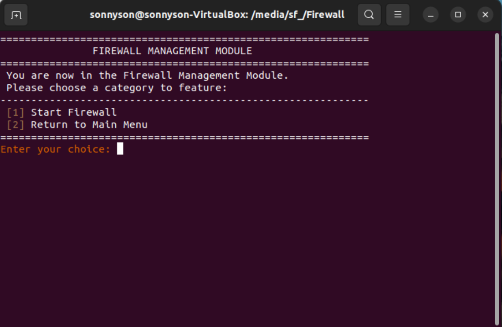

# Linux based Firewall

自製一套基於Linux核心的防火牆，可以有效阻擋惡意IP跟Port。

## 壹、基本說明
**ㄧ、動機：**
隨著近期資安議題日益升溫，關於防範機制的討論與創新也持續不斷。然而，在眾多防護手段中，最為經典且基礎的資訊安全措施-防火牆，依然是目前最有效且被廣泛應用的防禦機制。無論是路由器還是電腦，防火牆在各種網路環境中扮演著至關重要的角色，形成了資訊安全的第一道防線。基於此，本文將從學術研究的角度出發，著手開發一套防火牆系統，旨在為教學提供一個示範工具，並藉此加深對現代資訊安全防範技術的理解與應用。

**二、設計概念：**
該系統的主要目的是有效阻擋來自惡意IP和Port的攻擊流量，並提供一個高效的防護機制。系統基於Linux操作平台，並利用NFQUEUE機制來實現這一功能。NFQUEUE是Linux Netfilter框架提供的一個強大功能，它能夠將進來的封包轉交給用戶空間的程式進行進一步的處理。當封包被加入到隊列後，開發者編寫的應用程式便可以檢查這些封包的內容，根據預定的安全策略，進行修改或決定是否丟棄該封包。這樣的機制不僅增強了防禦效果，還能根據實際需求對封包流量進行細緻的監控與管理，從而有效抵禦各種惡意攻擊。

**三、開發環境：**
* 虛擬機：VirtualBox
* 作業系統：Ubuntu 22.04
* 程式語言：C
* 程式編輯器：Visual Studio Code

**四、檔案說明：**
```bash
.
├── LICENSE
├── README.md
└──  Firewall  # 開發程式資料夾
      ├── main.c  # 主程式
      ├── variables.h  # 定義變數
      ├── sharedFunctions.h  # 共用函式
      ├── sharedFunctions.c  # 共用函式
      ├── manageBlocklist.h  # 管理封鎖名單
      ├── manageBlocklist.c  # 管理封鎖名單
      ├── executeFirewall.h  # 執行防火牆
      ├── executeFirewall.c  # 執行防火牆
      ├── viewLogs.h  # 查詢日誌
      ├── viewLogs.c  # 查詢日誌
      ├── blocklist.conf  # 封鎖名單
      ├── firewall.log  # 日誌
      └── firewall  # Unix執行檔
```

## 貳、運行方式
**一、運行方式：**
1. 安裝套件
   ```shell
   sudo apt update
   sudo apt update
   sudo apt install build-essential
   sudo apt install linux-headers-$(uname -r)
   sudo apt install libnetfilter-queue-dev
   sudo apt install libnfnetlink-dev
   ```

2. 至executeFirewall.c的160行，添加root的密碼
   ```shell
   reply = system("echo '你的密碼' | sudo iptables -I INPUT -j NFQUEUE --queue-num 0");
   ```
> [!Warning]
> 請特別注意，以上程式碼主要功能是將進入主機的封包導入到Netfilter Queue，為重要系統運行關鍵步驟。所以，若出現"System command failed. 'sudo iptables -I INPUT -j NFQUEUE --queue-num 0' is not executed."時，可嘗試手動在終端機執行"sudo iptables -I INPUT -j NFQUEUE --queue-num 0"。
   
3. 編譯程式
   ```shell
   gcc -D_GNU_SOURCE -o firewall main.c manageBlocklist.c executeFirewall.c sharedFunctions.c viewLogs.c -lnetfilter_queue
   ```

4. 運行程式
   ```shell
   sudo ./firewall
   ```

5. 清空所有的iptables規則（非必要）
   ```shell
   sudo iptables -F
   ```
> [!Warning]
> 請特別注意，若有發生網路連線發生異常，請嘗試執行"sudo iptables -F"。

**二、運行結果：** 部分功能截圖
1. 主選單
<br>
  <div align="center">
  	
  </div>
<br>

2. 管理封鎖名單選單
<br>
  <div align="center">
  	
  </div>
<br>

3. 管理IP封鎖名單選單
<br>
  <div align="center">
  	
  </div>
<br>

4. 刪除IP封鎖名單
<br>
  <div align="center">
  	
  </div>
<br>

5. 執行防火牆
<br>
  <div align="center">
  	
  </div>
<br>

6. 顯示日誌
<br>
  <div align="center">
  	
  </div>
<br>
